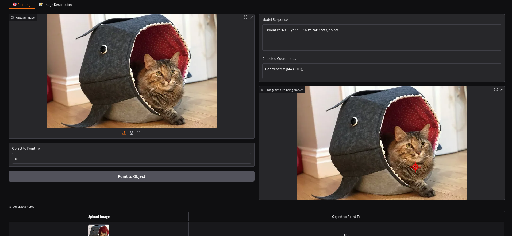
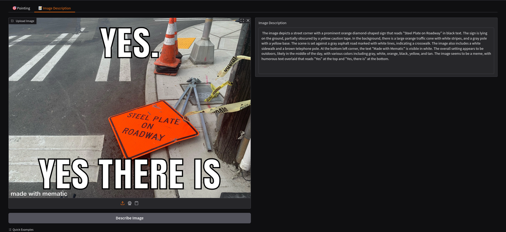

# Molmo Multi-Modal Demo

## How to run
```shell
docker compose up
```

The demo will run on CPU by default and will be available at [http://localhost:7860](http://localhost:7860).

### Running on GPU
You need to change the [docker-compose.yml](./docker-compose.yml) to do so. See it for details on how to run on GPU.

### Huggingface cache
By default, model weights will be stored in a docker volume mapping to the default location of huggingface cache: `~/.cache/huggingface/` on the local machine to prevent re-downloading.
You can change the location of the cache by setting the environment variable `DOCKER_HF_CACHE_PATH`.
Example:
```shell
export DOCKER_HF_CACHE_PATH=/path/to/cache
mkdir -p $DOCKER_HF_CACHE_PATH
docker compose up
```
Important: make sure the `DOCKER_HF_CACHE_PATH` exists before running the container!

### Setting the concurrency limit

The default limit is 1, set the environment variable `GRADIO_DEFAULT_CONCURRENCY_LIMIT` to change it or edit the `docker-compose.yml` file.
Possible commands:
```shell
GRADIO_DEFAULT_CONCURRENCY_LIMIT=2 docker compose up
```
```shell
GRADIO_DEFAULT_CONCURRENCY_LIMIT=2 python app.py
```

## Description
- Model: [MolmoE-1B-0924 from AllenAI](https://huggingface.co/allenai/MolmoE-1B-0924)
- Technical report: [ArXiv](https://arxiv.org/abs/2409.17146)

This demo showcases two capabilities of the Molmo model:

- **Pointing**: Identify and locate objects in images.
- **Image Description**: Generate detailed descriptions of images.

## Screenshots


